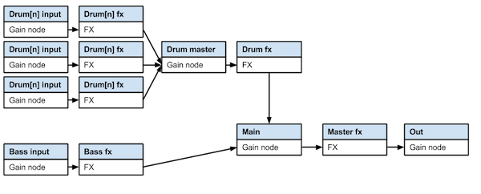
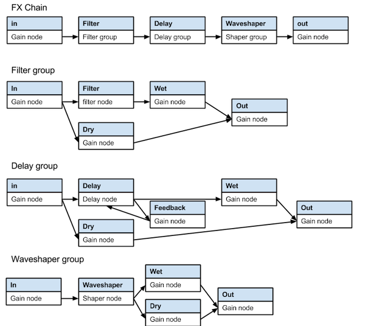

# Loops - technical design details
Loops is mostly implemented in javascript using the [Web Audio API][api] for all sound generation and processing.

## General design and organization
The code is organized into the following files:

* **loops.js** - Contains the document load function that is fired when the page first loads

* **interface.js** - functions for updating the interface based on interactions or other events.

* **initInterface.js** - Initializes the interface. Dynamically draws the pattern grids, creates the pattern and sequence rows, and creates all the parameter sliders.

* **gridInteractions.js** - defines the interaction behavior for the main interface sections: drum grid, bass grid, drum patterns, bass patterns. All mouse and touch interaction is defined here.

* **interactions.js** - defines the general interaction scheme, which combines mouse and touch events into a single set of functions.

* **sequencer.js** - functions for audio looping and playback

* **audioGraph.js** - sets up all the audio processing nodes and effects parameters

* **loadSave.js** - ajax based functions for saving to the server and loading saved patterns

* **render.js** - functions for rendering to a .wav file for download

* **sounds.js** - global declaration of sound files to use

* **loadSounds.js** - functions to load sound files into buffers for use in playback

***

The heart of the application is the sequencer loop and the audio graph. 

## Audio graph
Here is a visual representation of the audio routing used in the application. All audio nodes are standard web audio nodes.

## Sequencer loop
The sequencer loop is what keeps all the timing in sync. The basic method used is outlined in [this article][timing]. The loop runs using the `getAnimationFrame` method (60 frames/second), and uses a lookahead time of .1 seconds to schedule sounds for future playback.

## Loading/saving
Patterns are saved to the server using an ajax call to a very simple python script. There's a `count.txt` file which keeps track of how many patterns have been saved so far, so the next pattern is saved as `count + 1`. Saved parameters are passed to the python script as json, so no processing has to be done in python, only writing to a file.

To load patterns, the application simply does an ajax call to load one of the saved json files directly.

The python script uses no external modules, and should run in Python 2.6 or 2.7.

## Rendering
Rendering to .wav is accomplished using the offline rendering mode of the web audio api. Once the rendered audio data exists, .wav header file information is added to it, and it is converted to a data URI using javascript's Blob and FileReader APIs.

## External scripts/libraries used
* [jQuery][jquery]

* [Audio context monkey patch][monkeypatch] - this useful script normalizes the vendor prefixes for the web audio api to make cross browser support easier.

## Tools and technology used
* [Coda][coda] for code editing.

* [MAMP][mamp] for local webserver development

* [Hammer][hammer] for compiling html and css files locally. This is a very cool utility for building static websites - it allows for html includes and lots of little touches to ease development. It allowed me to keep all my javascript in individual files, and then automatically combine them into one file for publishing.

* [Sass][sass] - Allows for more advanced css functions like variables, nested selectors and functions. Also makes cross browser support much easier. This was my first time working with Sass, and I found it to be a great tool. Hammer automatically compiles Sass files into CSS.

* [Markdown][markdown] - Documentation files were written in markdown. Hammer compiles markdown files into HTML.

**Note:** The main directory has files with the hammer specific directives and won't run without hammer. The Build folder has the compiled files that should run on any webserver.

[hammer]: http://hammerformac.com/
[coda]: http://panic.com/Coda/
[monkeypatch]: https://github.com/cwilso/AudioContext-MonkeyPatch/
[jquery]: http://jquery.com/
[sass]: http://sass-lang.com/
[timing]: http://www.html5rocks.com/en/tutorials/audio/scheduling/
[api]: http://www.w3.org/TR/webaudio/
[markdown]: http://daringfireball.net/projects/markdown/
[mamp]: http://www.mamp.info/en/index.html